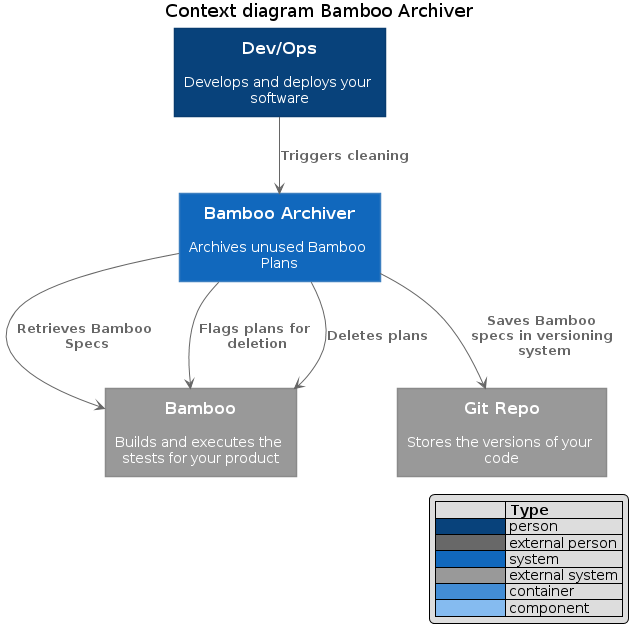
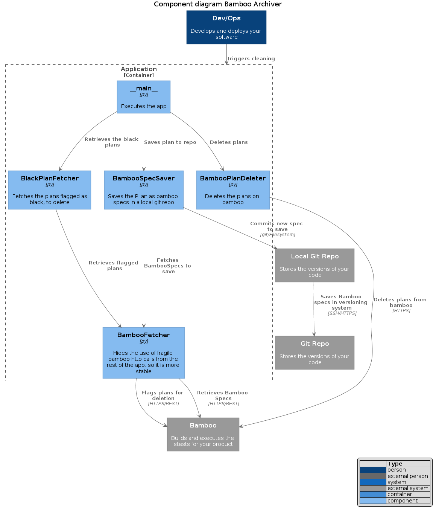

# bamboo-archiver
An archiver for bamboo, that saves the "deleted" plans to a git repo as Bamboospecs, for your peace of mind.



Are you interested in the internal structure? It is as follows...



## Installation
```shell
virtualenv env 
pip install -r requirements.txt
pip install flake8
pip install autopep8
flake8 . --count --exit-zero --max-complexity=10 --max-line-length=127 --statistics --exclude env
```